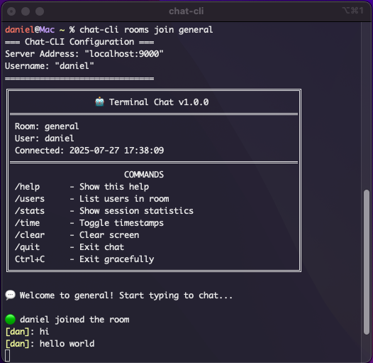

# Terminal-Chat

A simple command-line chat application built with Go, consisting of a chat server and a CLI client.

--- 

## Features

- Real-time messaging between multiple clients within terminal
- Cross-platform compatibility



#### Commands

- `chat-cli init`:	Initialize configuration file (username and server address)
- `chat-cli -h`:	Show help information
- `chat-cli rooms list`:	List all available rooms
- `chat-cli rooms join <room>`:	Join or create a specific room

## Requirements
- Computer with a terminal
- Go 1.19 or higher

## Usage

1. Clone the repository:
```bash
git clone https://github.com/danieljhkim/Terminal-Chat.git
cd Terminal-Chat
```

2. Build the project:
```bash
# Install dependencies
make deps

# Build binaries of server and cli
make build
```

3. Install cli binary to your system:
```bash
make install-cli

# if using pc, adjust Makefile to install to /usr/local/bin
```

4. Run the server:
```bash
make run-server
```

5. Open a new terminal and run the client:
```bash
# initialize chat-cli config
chat-cli init

# join/create a chat room
chat-cli rooms join room_name
```

## TODO's
- [ ] Add support for direct messages
- [ ] Implement user authentication & TLS
- [ ] Implement friend system
- [ ] Implement rate limiting
- [ ] Add input sanitation to prevent terminal injection attacks


## Acknowledgments
- Built with Cobra for CLI framework
- Uses Viper for configuration management
- Github Copilot

## License
This project is licensed under the MIT License - see the [LICENSE](LICENSE) file for details.